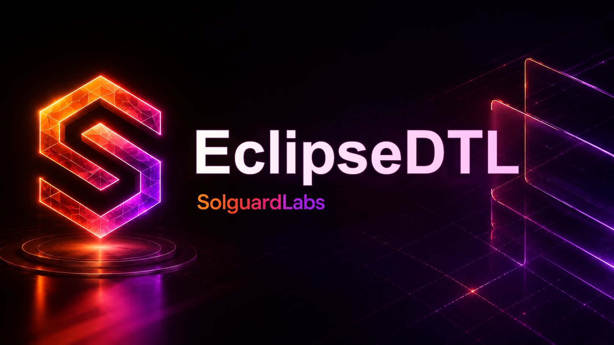

# EclipseDTL



EclipseDTL is a Rust engine for internal DTL liquidity auctions. Operators submit
route bids with price, fee and guarantee terms, and the engine selects a desk,
settles the batch against vault liquidity, records operator exposure and can move
to a fallback bid when a selected route cannot clear.

## Components

- `src/auction.rs`: bid admission, scoring and winner selection.
- `src/risk.rs`: route, liquidity and guarantee admission checks.
- `src/operators.rs`: operator state, guarantee pledges and exposure accounting.
- `src/settlement.rs`: batch settlement, fee routing and fallback execution.
- `src/scenario.rs`: JSON scenario runner used by integration tests.
- `tests/node/`: end-to-end tests that execute the public CLI.

## Requirements

- Rust stable toolchain.
- Node.js 20 or newer.
- Bash for local CI scripts.

## Usage

Run a scenario:

```bash
cargo run -- --scenario tests/fixtures/normal_batch.json
```

Run the Rust and JavaScript suites:

```bash
bash scripts/tests.sh
```

Run the full local CI profile:

```bash
bash scripts/ci.sh
```

## Scenario Model

Scenarios register assets, accounts, operators and routes, then open batches,
submit bids, select a winner and settle. Reports are emitted as JSON and include
events, balances, operator guarantee state, bid status and settlement receipts.

## Project Status

The repository is a compact protocol implementation intended for local audit
practice and deterministic CI execution. It does not require external services.
