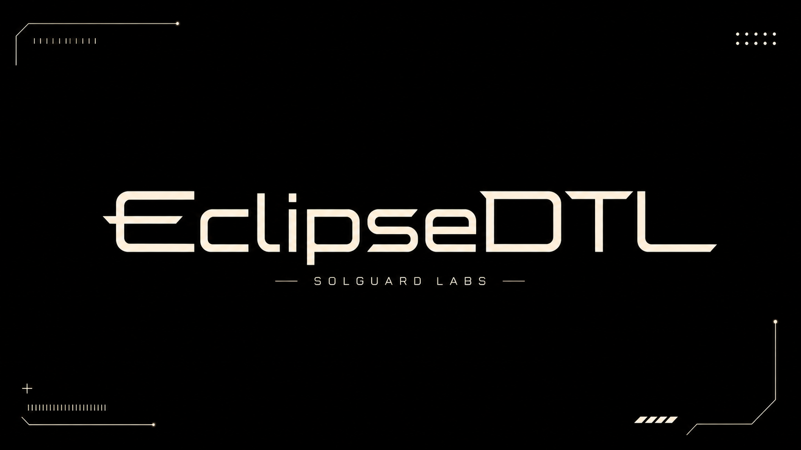
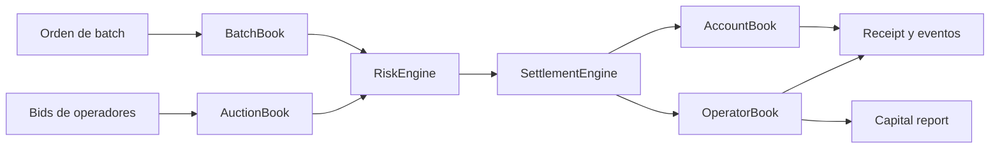
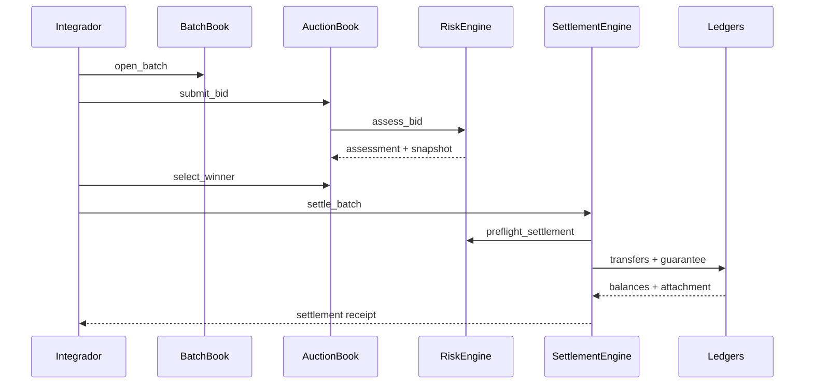
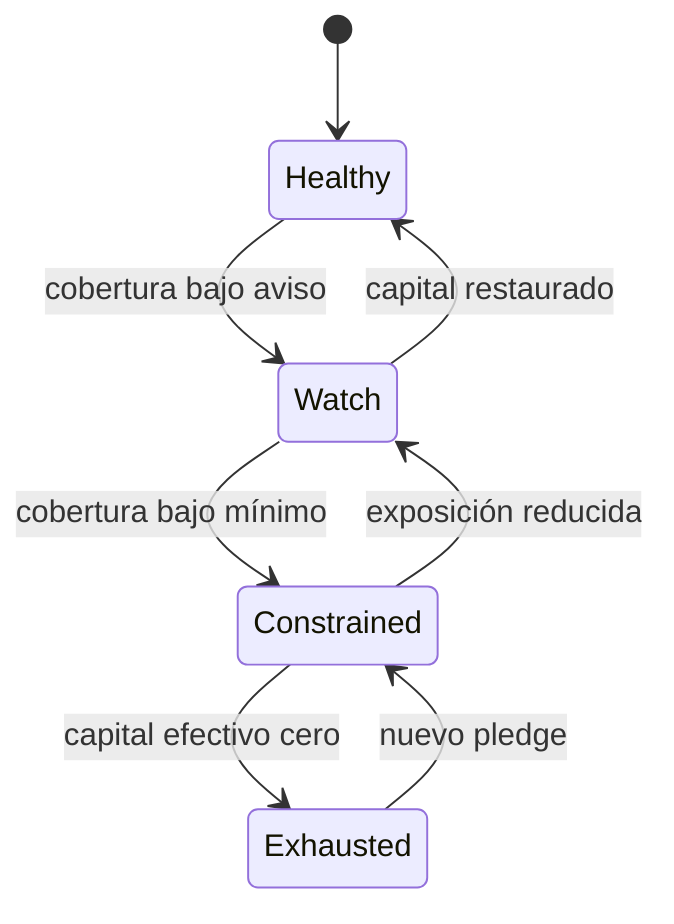

# EclipseDTL



EclipseDTL es un motor determinista de subastas de liquidez y settlement para
rutas DTL. Coordina órdenes por lotes, cotizaciones competitivas de operadores,
políticas de ruta, garantías, movimiento de activos, fallback y reconciliación
en una única máquina de estados auditable.

La entrega `Production 1.0.0` combina un núcleo Rust 1.97.1, escenarios JSON y
un cliente JavaScript para integraciones sin estado compartido ni servicios
externos implícitos.

## Capacidades

- admisión de bids con precio, fee, garantía, fiabilidad y límites por ruta;
- selección determinista por output neto, prioridad, garantía y penalización;
- settlement atómico entre payer, vault, recipient y cuenta de fees;
- fallback explícito a la siguiente oferta admitida;
- accounting de pledge, capital bloqueado y exposición por ruta y activo;
- análisis de cobertura estresada, utilización, shortfall y concentración HHI;
- snapshots, eventos, receipts y reconciliación por activo;
- cliente JavaScript con timeout, buffer acotado y ejecución sin shell.

## Arquitectura


```mermaid
flowchart LR
    I["Orden de batch"] --> B["BatchBook"]
    Q["Bids de operadores"] --> A["AuctionBook"]
    B --> R["RiskEngine"]
    A --> R
    R --> S["SettlementEngine"]
    S --> C["AccountBook"]
    S --> O["OperatorBook"]
    C --> X["Receipt y eventos"]
    O --> X
    O --> M["Capital report"]
```


```mermaid
sequenceDiagram
    participant U as Integrador
    participant B as BatchBook
    participant A as AuctionBook
    participant R as RiskEngine
    participant S as SettlementEngine
    participant L as Ledgers
    U->>B: open_batch
    U->>A: submit_bid
    A->>R: assess_bid
    R-->>A: assessment + snapshot
    U->>A: select_winner
    U->>S: settle_batch
    S->>R: preflight_settlement
    S->>L: transfers + guarantee
    L-->>S: balances + attachment
    S-->>U: settlement receipt
```


```mermaid
stateDiagram-v2
    [*] --> Healthy
    Healthy --> Watch: cobertura bajo aviso
    Watch --> Healthy: capital restaurado
    Watch --> Constrained: cobertura bajo mínimo
    Constrained --> Watch: exposición reducida
    Constrained --> Exhausted: capital efectivo cero
    Exhausted --> Constrained: nuevo pledge
```

## Flujo Economico

Para un input `x`, precio racional `p/q`, fee `f` y garantía seleccionada `g`:

```text
gross_out          = floor(x * p / q)
operator_fee       = floor(gross_out * f / 10_000)
net_out            = gross_out - operator_fee
required_guarantee = ceil(gross_out * g / 10_000)
```

El motor de capital aplica un escenario adicional sobre la exposición
registrada:

```text
stressed_exposure  = exposure + ceil(exposure * addon_bps / 10_000)
effective_guarantee = pledged - ceil(locked * haircut_bps / 10_000)
coverage_bps       = effective_guarantee * 10_000 / stressed_exposure
```

La concentración se expresa como un HHI normalizado en puntos básicos:

```text
HHI = sum((bucket_exposure / total_exposure)^2) * 10_000
```

## Componentes

| Componente | Responsabilidad |
| --- | --- |
| `src/batch.rs` | Ciclo de vida y condiciones de una orden agregada |
| `src/auction.rs` | Tickets, scoring, selección y fallback |
| `src/risk.rs` | Admisión económica y preflight de liquidez |
| `src/operators.rs` | Pledge, locks, releases y exposición |
| `src/settlement.rs` | Transferencias, fees, receipts y cierre |
| `src/capital.rs` | Cobertura estresada y agregación de red |
| `src/reconciliation.rs` | Comparación entre balances y movimientos |
| `src/telemetry.rs` | Contadores, gauges, histogramas y SLO |
| `src/scenario.rs` | Orquestación determinista desde JSON |
| `sdk/client.js` | Cliente de procesos para Node.js |

## Requisitos

- Rust `1.97.1` con `rustfmt` y `clippy`;
- Node.js `24` o superior;
- Bash para los comandos de validación.

El toolchain queda fijado en `rust-toolchain.toml` y Cargo usa el lockfile
versionado.

## Inicio Rapido

```bash
cargo build --locked
cargo run --locked -- --scenario tests/fixtures/normal_batch.json
```

El comando devuelve un informe JSON con eventos, cuentas, operadores, rutas,
batches, bids, receipts y snapshots.

Ejemplo mínimo de una acción:

```json
{
  "type": "submit_bid",
  "id": "bid-alpha",
  "batch": "batch-001",
  "route": "route-main",
  "operator": "op-alpha",
  "price_numerator": 101,
  "price_denominator": 100,
  "fee_bps": 20,
  "guarantee_bps": 1500,
  "received_at": 110,
  "expires_at": 450
}
```

## Cliente JavaScript

```js
const { EclipseScenarioClient } = require("./sdk");

const client = new EclipseScenarioClient({
  timeoutMs: 15_000,
  maxBuffer: 8 * 1024 * 1024,
});

const report = client.runFile("tests/fixtures/normal_batch.json");
console.log(report.receipts[0]);
```

`runScenario` acepta también un objeto en memoria, crea un archivo temporal con
permisos restrictivos y garantiza su limpieza. El proceso se inicia con
argumentos separados, `shell: false`, timeout y límite de salida.

## Validacion

```bash
bash scripts/tests.sh
bash scripts/ci.sh
```

El perfil completo ejecuta:

1. formato Rust;
2. build de todos los targets;
3. pruebas Rust y Node.js;
4. Clippy con warnings tratados como error;
5. contrato de estructura, documentación, banner y métricas.

La suite pública contiene 19 pruebas: 10 del modelo de capital y 9 de
integración/SDK.

## Entrega

La rama `production`, el tag anotado `v1.0.0` y el release
`Production 1.0.0` se promueven desde el mismo commit después de completar los
gates de CI e integridad.

## Documentacion

- [Arquitectura](./docs/architecture.md)
- [Subasta y routing](./docs/auction-and-routing.md)
- [Modelo económico](./docs/economic-model.md)
- [Capital y riesgo](./docs/capital-and-risk.md)
- [Lifecycle de settlement](./docs/settlement-lifecycle.md)
- [Operaciones](./docs/operations.md)
- [Integración](./docs/integration.md)
- [Política de seguridad](./SECURITY.md)

## Licencia

Apache-2.0. Consulta [LICENSE](./LICENSE).
