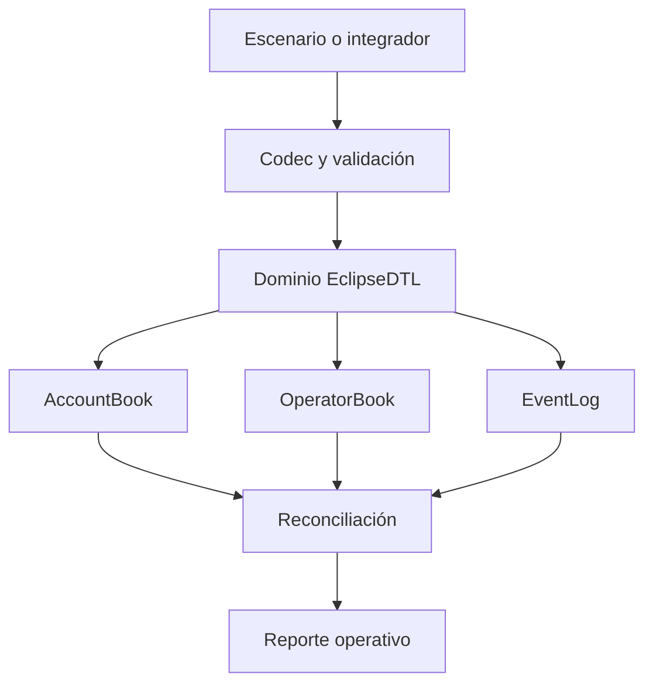
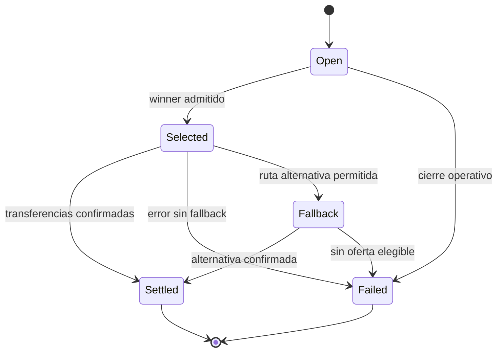
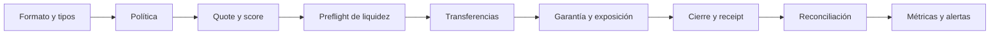

# Politica De Seguridad

EclipseDTL trata las subastas, garantías y transferencias como un único dominio
económico. Un cambio se considera seguro cuando conserva las invariantes de
activos, capital, lifecycle y determinismo tanto en la ruta principal como en
fallback.

## Limites De Confianza



- La entrada JSON no se considera confiable hasta completar deserialización y
  reglas de dominio.
- Assets, accounts, operators y routes deben existir antes de su uso.
- El vault es la cuenta de settlement configurada; no se infiere por labels.
- El cliente JavaScript no abre una shell ni concatena argumentos.
- Receipts y eventos son evidencia derivada, no sustituyen los balances.

## Invariantes Economicas

Para cada asset `a`:

```text
sum(balance_before[a]) + deposits[a]
= sum(balance_after[a]) + withdrawals[a]
```

Para cada settlement cerrado:

```text
gross_out = net_out + operator_fee
net_out >= batch.min_out
payer_debit = batch.amount_in
vault_target_debit = gross_out
```

Para capital de operador:

```text
locked + pending_release <= pledged
available = max(pledged - locked - pending_release - reserve_floor, 0)
recorded_exposure = route_exposure + external_exposure
```

El informe de capital añade escenarios y no muta el ledger.

## Estados Autorizados



No se aceptan transiciones desde estados terminales. Un fallback debe pertenecer
al mismo batch, permanecer vigente y haber superado admisión.

## Defensa En Profundidad



Controles disponibles:

- enteros comprobados para sumas, restas, multiplicaciones y divisiones;
- redondeo explícito: floor para output/fee y ceil para garantías;
- IDs tipados para impedir mezclar dominios;
- estados terminales y selección determinista;
- límites de fee, hops, slippage, input y liquidez;
- fiabilidad mínima y estados operativos de los operadores;
- reserva, release diferido y slash de garantía;
- análisis de cobertura, utilización y concentración;
- CI en Ubuntu y Windows con dependencias fijadas.

## Cambios De Alto Riesgo

Requieren revisión económica y escenarios de regresión:

- orden de transferencias en `SettlementEngine`;
- cálculo de gross, net, fee o garantía;
- reglas de elegibilidad y score;
- estados `Selected`, `Settled`, `Superseded` o fallback;
- semántica de pledge, locked, pending release o slash;
- sustitución de IDs tipados por strings sin validar;
- cambios en snapshots o reconciliación que oculten diferencias.

## Gestion De Dependencias

- `Cargo.lock` se versiona y CI usa `--locked`.
- Rust queda fijado a `1.97.1`.
- Node.js queda fijado a la línea `24` en CI.
- Dependabot revisa Cargo, npm y GitHub Actions.
- Las acciones reciben permisos `contents: read`.

## Respuesta Operativa

Ante una desviación de balances o capital:

1. detener nuevos batches de la ruta afectada;
2. conservar escenario, receipt, eventos y snapshot;
3. comparar balances por asset y exposición por operador;
4. aislar si el origen es admisión, ejecución, fallback o reconciliación;
5. reproducir con el mismo lockfile y toolchain;
6. aplicar una corrección con una propiedad económica permanente;
7. reabrir la ruta solo tras completar CI y revisión independiente.

## Comunicacion Privada

Los hallazgos sensibles deben comunicarse mediante un Security Advisory privado
del repositorio. Incluye commit, escenario mínimo, activos implicados, balances
antes/después, receipt observado y propuesta de propiedad de regresión. No
publiques detalles operativos mientras el análisis siga abierto.

## Versiones

La línea mantenida es `Production 1.0.0`. La integridad del release exige que
`main`, `production` y el commit pelado de `v1.0.0` coincidan.
