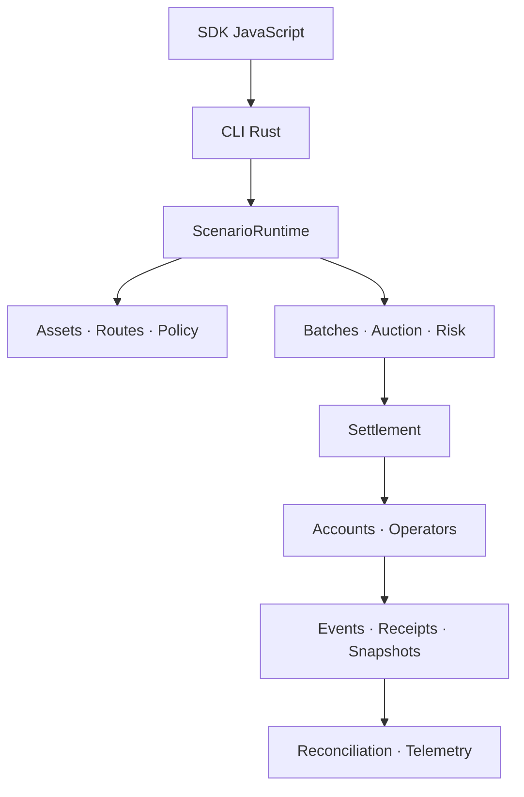
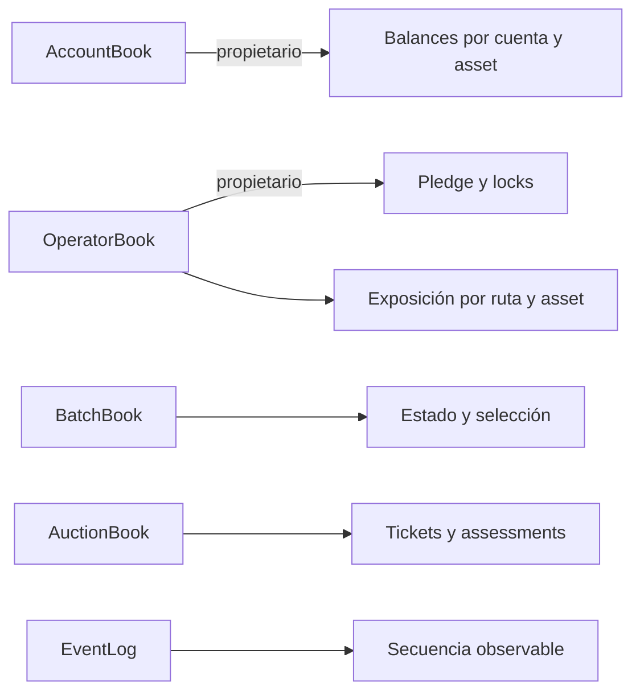
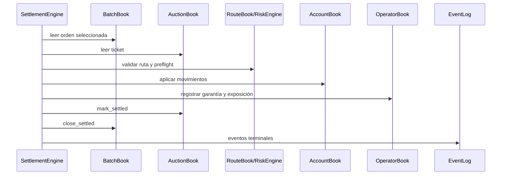

# Arquitectura

EclipseDTL separa configuración, decisión económica, mutación de ledgers y
evidencia. Esta división permite ejecutar el mismo escenario desde la librería,
el binario o el cliente JavaScript sin cambiar reglas de dominio.

## Capas

### Configuración

`AssetBook`, `RouteBook` y las políticas fijan unidades, precisión, límites de
input, slippage, floors de liquidez y requisitos mínimos. Los IDs son newtypes;
un `AssetId` no puede utilizarse accidentalmente como `OperatorId`.

### Decisión

`BatchBook` conserva la intención del payer. `AuctionBook` registra bids y su
assessment. `RiskEngine` calcula gross, net, garantía exigida, disponibilidad y
penalización de score.

### Ejecución

`SettlementEngine` verifica ruta y floor, comprueba liquidez, mueve source y
target, registra fees, adjunta garantía y emite un receipt estable.

## Propiedad Del Estado

Ningún módulo mantiene una segunda copia autoritativa de balances. Los
snapshots son fotografías serializables y los receipts describen el resultado
de una ejecución, pero las consultas posteriores parten siempre de los books.

## Dependencias Del Settlement

## Determinismo

- `BTreeMap` produce orden estable al serializar vistas.
- Los empates de score se resuelven por `received_at` e ID.
- Los ratios son enteros racionales; no se usa coma flotante.
- Los redondeos están definidos por función y unidad.
- Un escenario contiene todos los timestamps relevantes.

## Extensión Segura

Para añadir una nueva clase de ruta:

1. definir su prioridad y límites en `routes.rs`;
2. mantener source/target tipados;
3. incorporar el cálculo a quote y preflight;
4. añadir escenarios nominales, límites y fallback;
5. incluir sus buckets en capital y reconciliación;
6. documentar redondeos y eventos nuevos.

El módulo `capital.rs` es deliberadamente de solo lectura: transforma el estado
del operador en métricas de cobertura sin alterar pledge, locks ni exposición.
