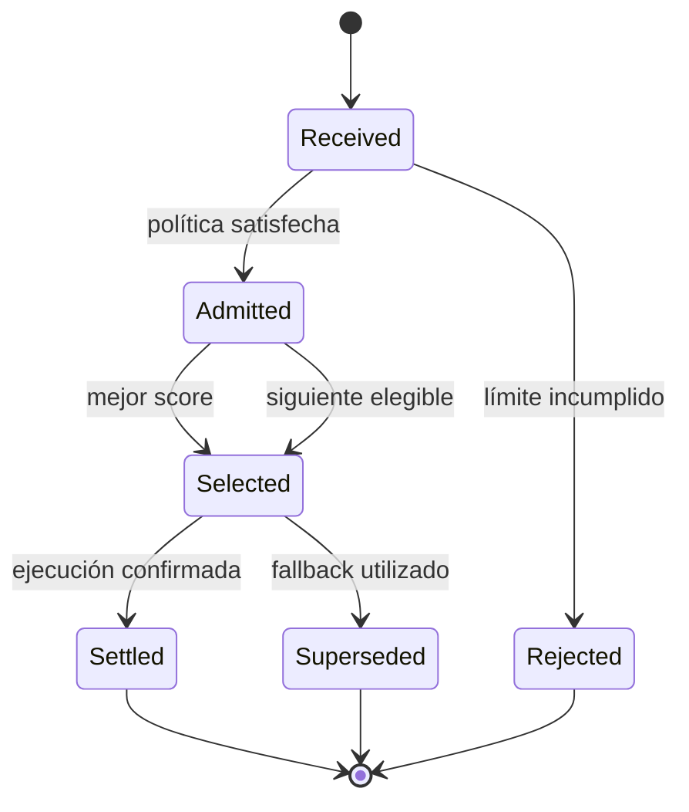
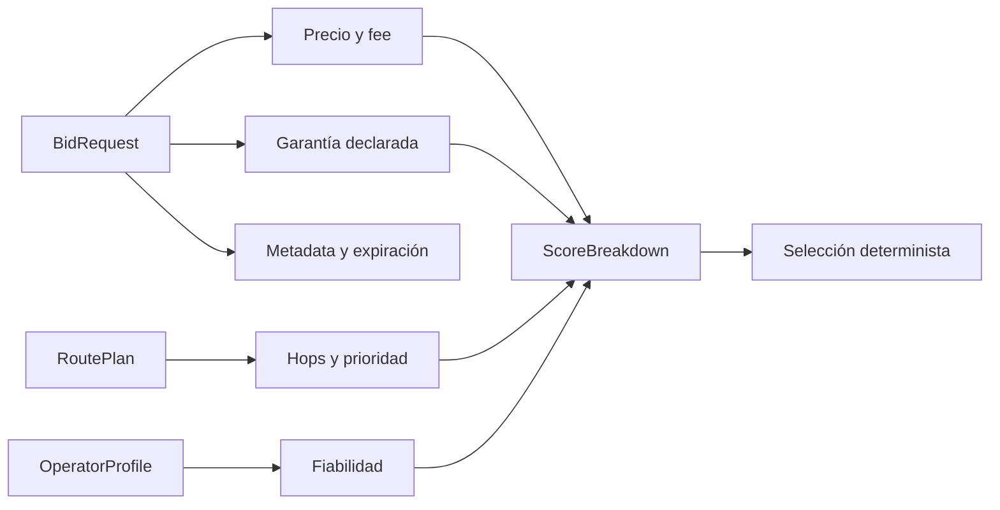
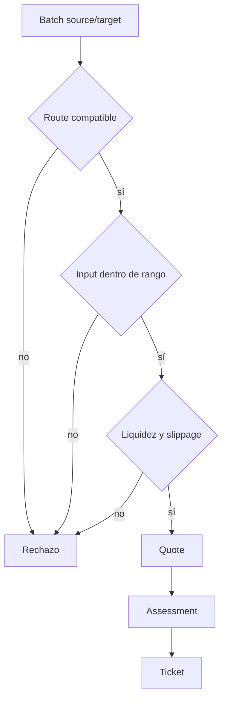

# Subasta Y Routing

La subasta transforma cotizaciones heterogéneas en tickets comparables. Cada
ticket conserva la solicitud original, el snapshot de admisión, el desglose de
score y su estado.

## Ciclo Del Bid



Un ticket es elegible cuando está admitido, no ha expirado y su estado permite
selección. La expiración se evalúa con el timestamp suministrado por el caller.

## Score

```text
final_score = net_out
            + route_priority
            + guarantee_bps
            - 3 * fee_bps
            - risk_penalty

risk_penalty = 8 * fee_bps
             + 10 * route_hops
             - reliability_bps / 25
             - guarantee_bps / 20
```

El score usa enteros con signo para conservar bonus y penalizaciones sin
conversiones ambiguas. Un output neto mayor suele dominar, pero fiabilidad,
fees, garantía y complejidad de ruta rompen proximidades.



## Reglas De Admision

- la ruta debe estar registrada, habilitada y referenciar assets válidos;
- el operador debe estar `active` y superar la fiabilidad mínima;
- los hops no pueden exceder el máximo de política;
- el fee debe respetar el máximo global;
- el quote debe respetar límites de input y liquidez de ruta;
- el vault debe disponer del gross proyectado;
- la garantía disponible debe cubrir la exigencia calculada.

## Routing

Una ruta fija source, target, clase, precio base, slippage, floors, rango de
input, ranking de fallback, venue y legs. `RoutePlan::quote` centraliza las
reglas que afectan al importe; settlement vuelve a comprobar que los assets de
la ruta coinciden con la orden.



## Fallback

Cuando la orden lo permite o el caller lo solicita, un error de ejecución del
seleccionado habilita `select_next`. La alternativa:

1. pertenece al mismo batch;
2. no es el bid excluido;
3. fue admitida;
4. permanece vigente;
5. maximiza el mismo score estable.

El bid inicial pasa a `superseded`, la alternativa a `settled` y el batch
registra `fallback_bid`. El evento conserva origen, destino y motivo operativo.

## Ejemplo De Comparacion

| Campo | Alpha | Beta |
| --- | ---: | ---: |
| Gross | 10.100 | 10.050 |
| Fee bps | 20 | 10 |
| Guarantee bps | 1.500 | 1.200 |
| Reliability bps | 10.000 | 9.800 |
| Hops | 1 | 1 |

La comparación se realiza sobre `final_score`; no depende del orden de llegada
salvo cuando dos resultados son exactamente iguales.
