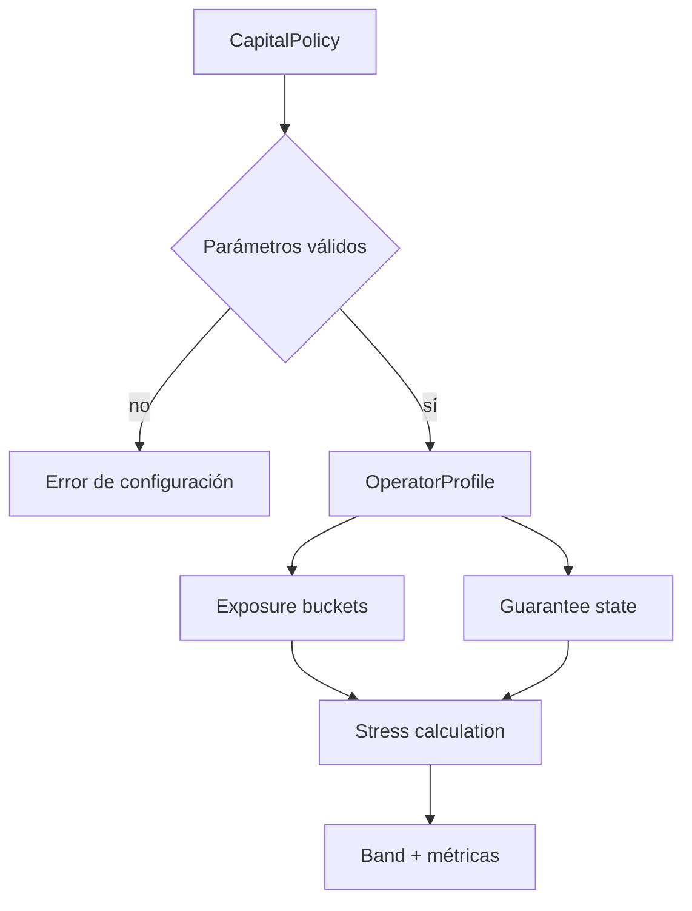
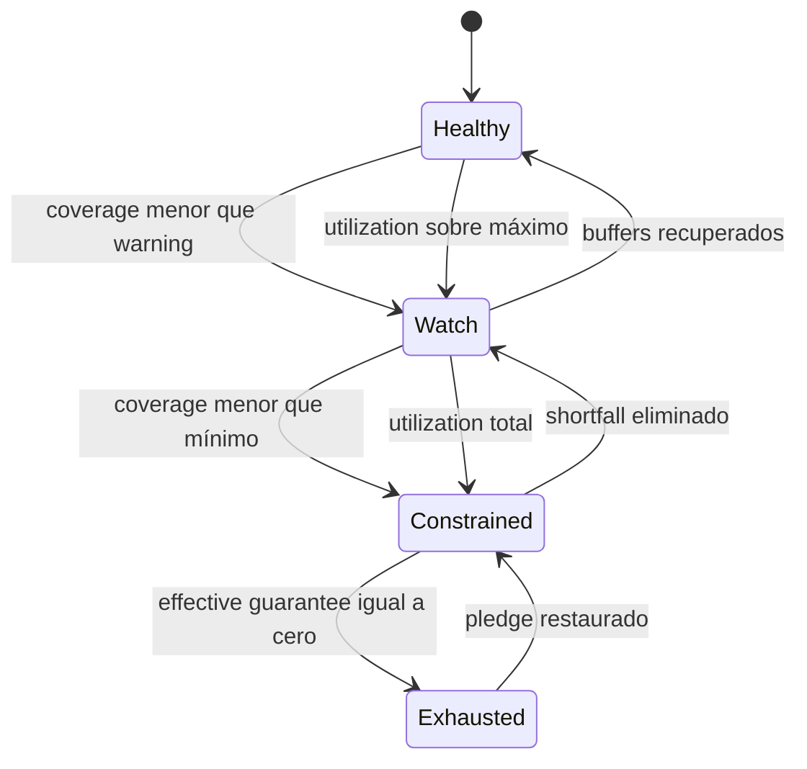
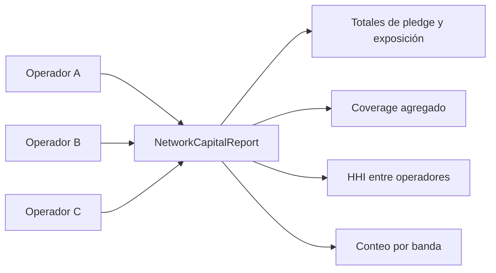

# Capital Y Riesgo

El dominio de riesgo tiene dos horizontes. `RiskEngine` decide si una oferta
puede entrar en la subasta; `capital.rs` transforma la cartera vigente de cada
operador en métricas de cobertura y concentración para operación continua.

## Politica De Capital

Valores por defecto:

| Parámetro | Valor | Función |
| --- | ---: | --- |
| Minimum coverage | 10.000 bps | Floor de cobertura estresada |
| Warning coverage | 12.000 bps | Umbral preventivo |
| Maximum utilization | 8.500 bps | Límite de capital bloqueado |
| Exposure addon | 500 bps | Shock sobre exposición registrada |
| Locked haircut | 1.000 bps | Descuento sobre capital inmovilizado |

La validación es fail-closed: los umbrales de cobertura deben estar ordenados y
los parámetros porcentuales no pueden superar 10.000 bps.

## Bandas

- `healthy`: buffers superiores a los umbrales.
- `watch`: capacidad utilizable, pero cerca de un límite.
- `constrained`: cobertura bajo mínimo o utilización total.
- `exhausted`: existe exposición estresada y no queda capital efectivo.

## Reporte De Operador

El snapshot incluye:

- pledged, locked, pending release y available;
- exposición por rutas y compromisos externos;
- exposición registrada y estresada;
- garantía efectiva, surplus y shortfall;
- coverage y utilization en bps;
- mayor bucket y HHI;
- banda operativa.

El cálculo es de solo lectura y serializable con Serde.

## Agregacion De Red

El reporte agregado conserva los snapshots individuales y añade concentración
entre operadores usando su exposición estresada como peso. Esto evita que una
cobertura total saludable oculte dependencia excesiva de una única desk.

## Alertas Recomendadas

| Señal | Aviso | Crítico |
| --- | ---: | ---: |
| Coverage | `< 12.000 bps` | `< 10.000 bps` |
| Utilization | `> 8.500 bps` | `= 10.000 bps` |
| Largest operator share | `> 4.000 bps` | `> 6.000 bps` |
| Operator HHI | `> 2.500 bps` | `> 4.000 bps` |
| Shortfall | `> 0` | crecimiento continuo |

Los umbrales de concentración dependen del número esperado de operadores y
deben calibrarse con datos históricos.

## Stress Operativo

Un escenario puede aumentar `exposure_addon_bps` para modelar movimientos de
precio, demora de salida o correlación. El haircut de capital bloqueado modela
que una parte del pledge no sea recuperable inmediatamente.

Los resultados deben compararse por versión de política. Cambiar addon o
haircut sin conservar la configuración junto al snapshot impide auditar la
serie temporal.
