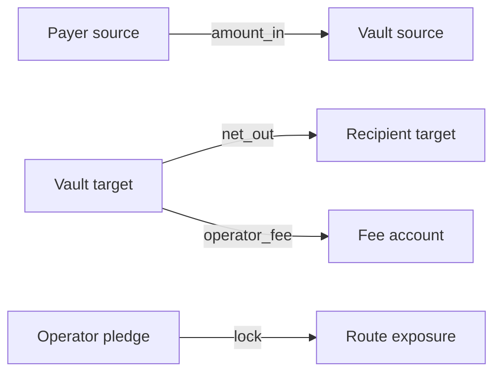
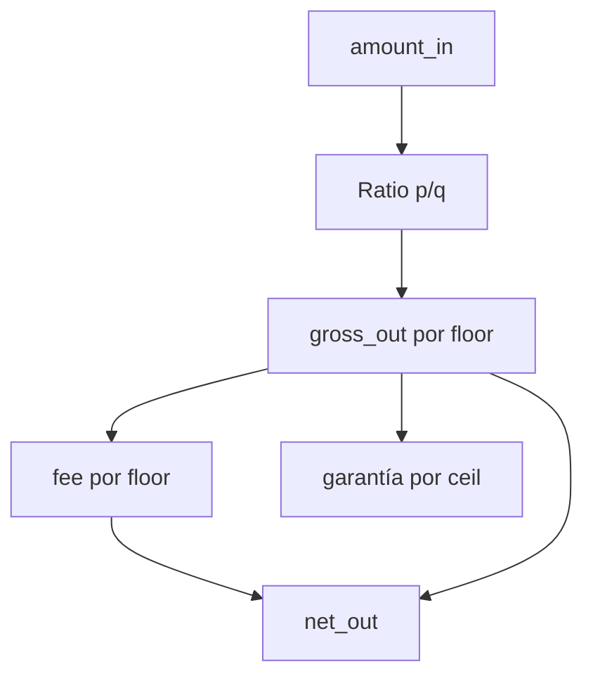
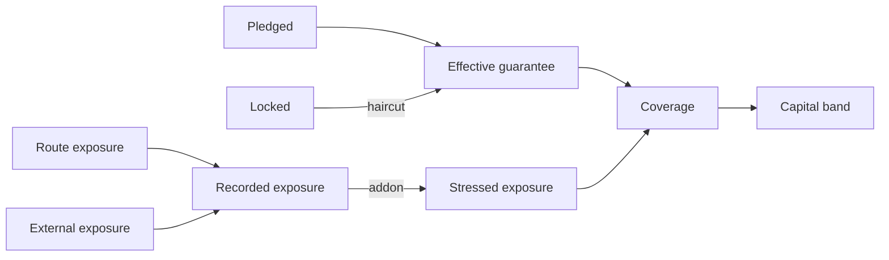

# Modelo Economico

EclipseDTL mueve dos activos por batch: el payer entrega el asset source al
vault y el vault entrega el asset target al recipient y al operador. La
garantía es un ledger económico separado y no representa saldo del asset.

## Conservacion Por Asset



Para source:

```text
payer_source_after = payer_source_before - amount_in
vault_source_after = vault_source_before + amount_in
```

Para target:

```text
vault_target_after = vault_target_before - gross_out
recipient_after    = recipient_before + net_out
fee_account_after  = fee_account_before + operator_fee
gross_out          = net_out + operator_fee
```

## Precio Y Redondeo

El precio se almacena como ratio exacto `p/q`:

```text
gross_out = floor(amount_in * p / q)
```

El fee favorece la conservación del vault mediante floor:

```text
operator_fee = floor(gross_out * fee_bps / 10_000)
net_out      = gross_out - operator_fee
```

La garantía utiliza ceil para no perder unidades atómicas:

```text
selected_guarantee_bps = max(global_floor, route_floor, bid_bps)
required_guarantee     = ceil(gross_out * selected_guarantee_bps / 10_000)
```



## Ejemplo

Con `amount_in = 10.000`, `p/q = 101/100`, `fee = 20 bps` y garantía
`1.500 bps`:

```text
gross_out          = 10.100
operator_fee       = 20
net_out            = 10.080
required_guarantee = 1.515
```

El payer pierde 10.000 EUSD, el vault recibe 10.000 EUSD, el recipient recibe
10.080 ELIQ y la cuenta del operador recibe 20 ELIQ.

## Capital Estresado

El análisis de capital usa exposición registrada, addon y haircut:

```text
recorded_exposure = route_exposure + external_exposure
stressed_exposure = recorded_exposure * (1 + addon)
effective_capital = pledged - locked * haircut
coverage          = effective_capital / stressed_exposure
shortfall         = max(stressed_exposure - effective_capital, 0)
```



## Concentracion

Los buckets son las exposiciones por ruta más el compromiso externo. Para cada
bucket `i` se calcula `share_i`, y:

```text
largest_share = max(share_i)
HHI_bps       = sum(share_i^2) * 10_000
```

Una sola ruta produce `10.000` bps de HHI. Tres buckets iguales producen
aproximadamente `3.333` bps.

## Reconciliacion

La reconciliación no confía únicamente en el receipt. Compara:

- balances agregados antes y después;
- movimientos por asset;
- gross frente a net más fee;
- estados terminales de batch y bid;
- exposición y capital del operador;
- eventos obligatorios de cierre.

Las diferencias deben expresarse en unidades atómicas, nunca en floats.
