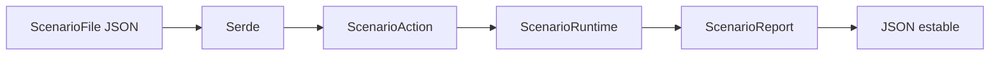
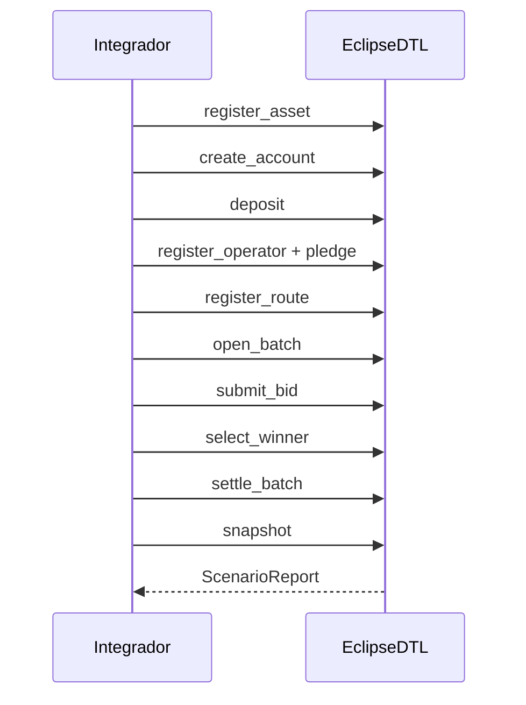
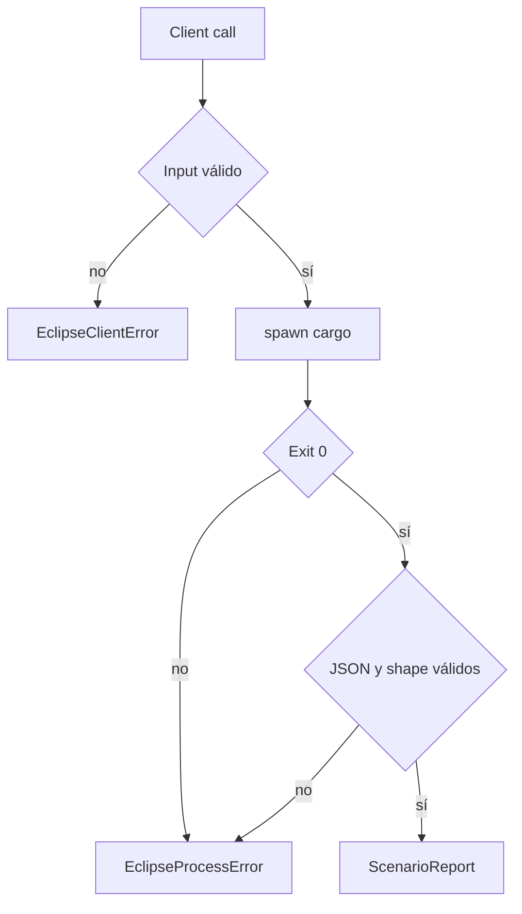

# Integracion

EclipseDTL expone una librería Rust, un binario de escenarios y un cliente
CommonJS. Los tres consumen el mismo modelo serializable.

## Contrato De Escenario



Raíz:

```json
{
  "name": "daily-eu-settlement",
  "vault_account": "vault",
  "actions": []
}
```

Las acciones se ejecutan en orden. El timestamp forma parte de las acciones que
lo necesitan; no se consulta el reloj del sistema.

## Orden Recomendado



## CLI

```bash
cargo run --locked -- --scenario tests/fixtures/normal_batch.json
```

El proceso escribe únicamente el reporte JSON en stdout. Los errores se envían
a stderr y el exit code es distinto de cero.

## SDK JavaScript

```js
const { EclipseScenarioClient } = require("./sdk");

const client = new EclipseScenarioClient({
  cargo: process.env.ECLIPSEDTL_CARGO || "cargo",
  cwd: process.cwd(),
  timeoutMs: 15_000,
  maxBuffer: 8 * 1024 * 1024,
});

const report = client.runFile("tests/fixtures/normal_batch.json");
```

Propiedades:

- `shell: false` y argumentos separados;
- rutas `.json` verificadas antes de iniciar proceso;
- timeout y max buffer positivos;
- stderr acotado en errores tipados;
- validación de las colecciones del reporte;
- archivos temporales con modo `0600` y cleanup garantizado.

## Manejo De Errores



No utilices `stderr` como fuente de estado. La semántica de negocio reside en
el JSON y en el código de salida.

## Integracion Rust

```rust
use eclipsedtl::scenario::run_scenario_str;

let report = run_scenario_str(input_json)?;
for receipt in report.receipts {
    println!("{}", receipt.key);
}
```

Para análisis de capital:

```rust
use eclipsedtl::{CapitalPolicy, NetworkCapitalReport};

let report = NetworkCapitalReport::assess(&operators, &CapitalPolicy::default())?;
assert_eq!(report.total_shortfall, 0);
```

## Compatibilidad

- Los IDs se serializan como strings.
- Los importes se serializan como enteros atómicos `u128` en reportes.
- Las entradas de escenarios usan `u64` y deben respetar el rango seguro del
  productor JSON.
- Los enums mantienen nombres Serde documentados en los fixtures.
- Nuevos campos de reporte deben ser aditivos siempre que sea posible.

## Checklist Del Consumidor

1. fijar commit, Rust, Node y lockfile;
2. validar IDs e importes antes de construir acciones;
3. establecer timeout y buffer explícitos;
4. persistir scenario hash y report hash;
5. correlacionar batch, bid, route y operator;
6. rechazar reportes incompletos;
7. reconciliar balances y capital antes de marcar el proceso como final.
