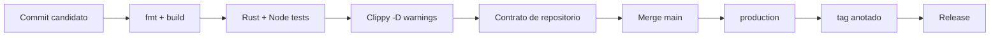
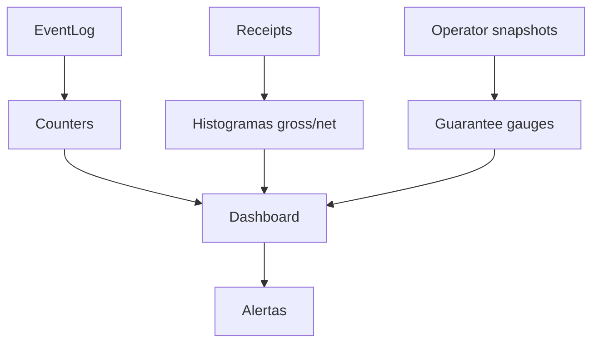
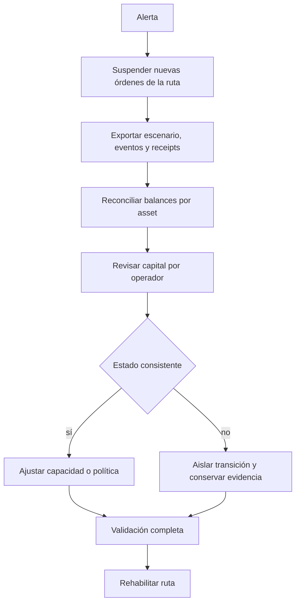

# Operaciones

Esta guía cubre build reproducible, ejecución, señales, respuesta y promoción
de versiones.

## Preparacion

```bash
rustup show
node --version
cargo build --locked
bash scripts/ci.sh
```

El toolchain esperado es Rust 1.97.1 y Node.js 24. El repositorio no descarga
estado de negocio: cada escenario declara configuración, acciones y tiempo.

## Pipeline



CI corre en Ubuntu y Windows. El gate de integridad comprueba que las referencias
de entrega coincidan cuando existe un tag o release.

## Señales



Métricas mínimas:

- batches abiertos, settled, failed y con fallback;
- gross/net/fee por ruta y operador;
- latencia entre apertura, selección y cierre;
- pledge, locked, available y shortfall;
- coverage, utilization, largest share y HHI;
- diferencias de reconciliación por asset.

## Runbook De Desviacion



No se debe compensar una diferencia editando manualmente receipts o eventos.
Las correcciones de balances requieren una transición explícita y auditable.

## Backups Y Evidencia

Conservar juntos:

- escenario JSON original y hash;
- commit y toolchain;
- stdout JSON completo y stderr;
- configuración de política;
- snapshots previos y posteriores;
- identificadores de CI y release.

## Promocion

1. rama `feature/...` y PR en draft;
2. CI verde de push y PR;
3. merge a `main` y CI verde;
4. crear `production` desde el SHA exacto;
5. validar CI e integridad de `production`;
6. crear tag anotado `v1.0.0` sobre el mismo SHA;
7. validar tag y publicar `Production 1.0.0`;
8. validar el evento release.

## Rollback

Una versión publicada no se mueve ni se reetiqueta. Ante una regresión:

- detener promociones;
- crear un commit correctivo desde `main`;
- ejecutar la batería completa;
- promover una nueva versión;
- conservar la versión anterior y su evidencia.
