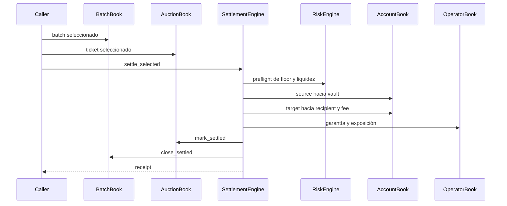
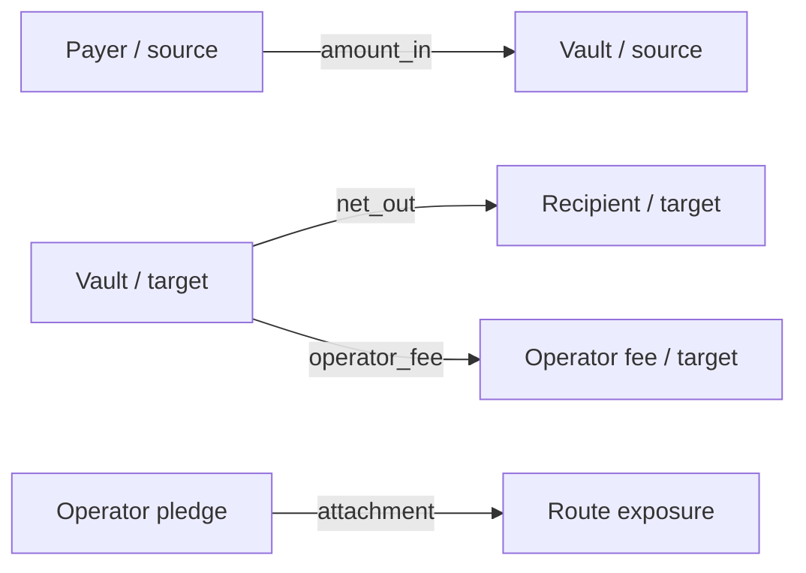
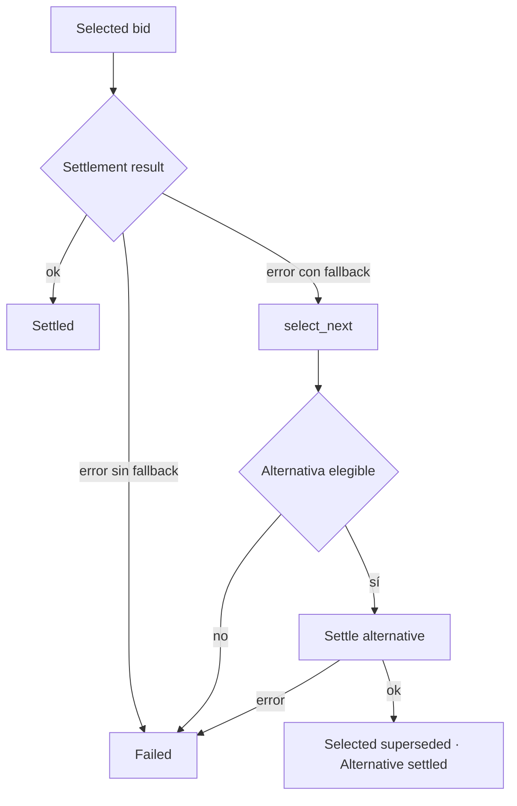

# Lifecycle De Settlement

Settlement consume un batch seleccionado y produce una transición terminal,
movimientos de activos, accounting de operador, receipt y eventos. Todas las
decisiones se expresan mediante resultados tipados.

## Ruta Principal



## Precondiciones

- batch existente y no terminal;
- bid seleccionado para el mismo batch;
- ticket vigente;
- source y target de la ruta iguales a los de la orden;
- `net_out >= min_out`;
- balance target del vault suficiente para `gross_out`;
- cuentas de payer, recipient, vault y fee registradas.

## Movimientos



El receipt guarda importes atómicos, IDs de batch/bid/route, operador, assets,
required/attached guarantee y si la ruta fue fallback.

## Fallback



La alternativa se ordena con el mismo score. El evento
`settlement_fallback` conserva ambos bids y el motivo que impidió completar la
primera ruta.

## Idempotencia Y Terminalidad

Los books impiden reabrir un batch terminal. Una integración debe usar el
estado del batch y el `SettlementKey` como clave de idempotencia. Reenviar un
escenario completo no equivale a reintentar una transición sobre el mismo
runtime: crea un estado determinista nuevo.

## Receipt Operativo

Campos principales:

```json
{
  "operator": "op-alpha",
  "amount_in": 10000,
  "gross_out": 10100,
  "net_out": 10080,
  "operator_fee": 20,
  "required_guarantee": 1515,
  "attached_guarantee": 1515,
  "fallback": false
}
```

La aceptación operativa debe correlacionar receipt, eventos y balances del
snapshot final.

## Recuperacion

Si un batch termina `failed`, conserva el motivo. La recuperación consiste en
crear una nueva orden o corregir capacidad/configuración; nunca en editar el
estado terminal. Los movimientos aplicados deben reconciliarse antes de
reintentar a nivel de negocio.
